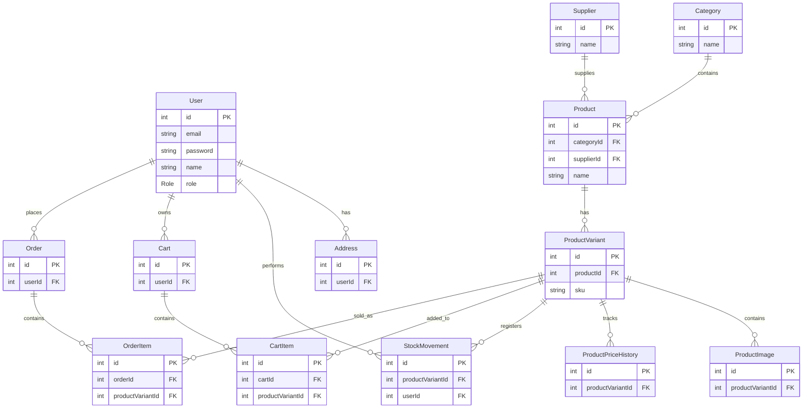

# TiendaFriki – Proyecto FullStack (Node + React + PostgreSQL)

# Descripción
TiendaFriki es una plataforma prácticamente completa de comercio electrónico enfocada en productos frikis.

El proyecto cumple todos los requisitos del enunciado, incluyendo:

    API REST con 4 recursos principales

    Autenticación JWT

    Roles (user/admin)

    Base de datos PostgreSQL con Prisma ORM

    Validaciones en todos los endpoints

    Manejo de errores centralizado

    Integración externa (EmailJS)

    Frontend en React con Context API

    Carrito persistente

    Diseño responsive

    CSS Modules

    Tests unitarios e integración

    Deploy completo

## Despliegue Online
**Vercel**: https://proyecto-3-full-proyect-backend-fro.vercel.app/

Conectado a través de Railway

## Integración externa: EmailJS
El proyecto incluye una integración externa mediante EmailJS, usada para enviar un email automático cuando un usuario se suscribe al newsletter desde el footer.

## Estilos y diseño (Resumen)
El diseño de TiendaFriki está construido con CSS Modules, lo que permite mantener los estilos aislados por componente y evitar conflictos entre clases. Cada vista y componente tiene su propio archivo .module.css, facilitando la escalabilidad y el mantenimiento del proyecto.

El enfoque es Mobile First, con breakpoints principales para móvil (≤500px), tablet (≤780px) y escritorio (≥1080px). Esto garantiza que todas las páginas —tienda, ofertas, carrito, detalle de producto y panel admin— se adapten correctamente a cualquier dispositivo.

A nivel visual, la interfaz utiliza glassmorphism, sombras suaves, bordes redondeados y gradientes para lograr un estilo moderno y limpio. El layout combina Flexbox y CSS Grid para organizar productos, formularios y secciones de forma fluida y flexible.

En resumen, el sistema de estilos es:

    Modular (CSS Modules)

    Responsivo (Mobile First + media queries)

    Moderno (glassmorphism, sombras, gradientes)

    Escalable (estructura clara por componente)

## Stack

- **Backend:** Node.js + Express + Prisma + PostgreSQL + JWT + Zod + Vitest
- **Frontend:** React 18 + Vite + React Router v6 + CSS Modules

## Puesta en marcha

## Backend

```bash
cd backend
npm install
cp .env.example .env
# Edita .env con tu DATABASE_URL
npx prisma migrate dev --name init
node prisma/seed.js
npm run dev
```

## Frontend

```bash
cd frontend
npm install
npm install emailjs-com
cp .env.example .env
npm run dev
```

## Usuarios de prueba (tras seed)

| Email | Contraseña | Rol |
|---|---|---|
| admin@inventory.com | admin123 | ADMIN |
| manager@inventory.com | manager123 | MANAGER |

Los nuevos registros obtienen rol "user" (solo lectura).


## Rutas principales
    / – Home

    /tienda – Tienda

    /offers – Ofertas

    /product/:id – Detalle

    /cart – Carrito

    /login – Login

    /register – Registro

    /admin/* – Panel admin (protegido)

## Carrito de compra
    Implementado con Context API:

    Añadir productos

    Variantes

    Aumentar / disminuir cantidad

    Eliminar producto

    Vaciar carrito

    Persistencia en localStorage


## Tests

```bash
cd backend
npm test
```

## Endpoints de la API

| Método | Ruta | Descripción | Auth | Rol |
|---|---|---|---|---|
| POST | /api/auth/register | Registro | — | — |
| POST | /api/auth/login | Login | — | — |
| GET | /api/dashboard | Estadísticas e inventario | ✓ | any |
| GET | /api/products | Lista de productos | ✓ | any |
| GET | /api/products/:id | Detalle + movimientos | ✓ | any |
| POST | /api/products | Crear producto | ✓ | MANAGER/ADMIN |
| PUT | /api/products/:id | Editar producto | ✓ | MANAGER/ADMIN |
| DELETE | /api/products/:id | Borrar producto | ✓ | ADMIN |
| POST | /api/products/:id/movements | Registrar movimiento | ✓ | MANAGER/ADMIN |
| GET | /api/products/:id/movements | Historial | ✓ | any |
| GET | /api/categories | Lista categorías | ✓ | any |

## Estructuras de carpetas

# Backend
backend/
│
├── app.js
├── server.js
├── package.json
├── package-lock.json
├── .env
├── .env.example
├── .gitignore
│
├── controllers/
│   ├── auth.controller.js
│   ├── categories.controller.js
│   ├── dashboard.controller.js
│   ├── products.controller.js
│   └── suppliers.controller.js
│
├── routes/
│   ├── auth.routes.js
│   ├── categories.routes.js
│   ├── dashboard.routes.js
│   ├── products.routes.js
│   └── suppliers.routes.js
│
├── middleware/
│   ├── auth.js
│   ├── isAdmin.js
│   └── errorHandler.js
│
├── schemas/
│   ├── auth.schema.js
│   └── product.schema.js
│
├── prisma/
│   ├── schema.prisma
│   └── migrations/
│       └── ... (migraciones generadas)
│
└── tests/
    ├── auth.test.js
    └── products.test.js

# Frontend

frontend/
│
├── index.html
├── package.json
├── package-lock.json
├── vite.config.js
├── .env
├── .env.example
├── .gitignore
│
├── public/
│
└── src/
    ├── main.jsx
    ├── App.jsx
    ├── index.css
    │
    ├── config/
    │   └── api.js
    │
    ├── context/
    │   ├── AuthContext.jsx
    │   └── CartContext.jsx
    │
    ├── hooks/
    │   └── useApi.js
    │
    ├── components/
    │   ├── Header/
    │   │   ├── Header.jsx
    │   │   └── Header.module.css
    │   │
    │   ├── Footer/
    │   │   ├── Footer.jsx
    │   │   └── Footer.module.css
    │   │
    │   ├── Categories/
    │   │   ├── Categories.jsx
    │   │   └── Categories.module.css
    │   │
    │   ├── FeaturedProducts/
    │   │   ├── FeaturedProducts.jsx
    │   │   └── FeaturedProducts.module.css
    │   │
    │   ├── Offers/
    │   │   ├── Offers.jsx
    │   │   └── Offers.module.css
    │   │
    │   ├── Hero/
    │   │   ├── Hero.jsx
    │   │   └── Hero.module.css
    │   │
    │   └── HeaderAdmin/
    │       ├── Navbar.jsx
    │       ├── Navbar.module.css
    │       └── ProtectedRoute.jsx
    │
    ├── pages/
    │   ├── Store/
    │   │   ├── StorePage.jsx
    │   │   └── StorePage.module.css
    │   │
    │   ├── OffersPage/
    │   │   ├── OffersPage.jsx
    │   │   └── OffersPage.module.css
    │   │
    │   ├── Product/
    │   │   ├── ProductPage.jsx
    │   │   └── ProductPage.module.css
    │   │
    │   ├── Cart/
    │   │   ├── Cart.jsx
    │   │   └── Cart.module.css
    │   │
    │   ├── Admin/
    │   │   ├── CategoryNew/
    │   │   │   ├── CategoryNew.jsx
    │   │   │   └── CategoryNew.module.css
    │   │   │
    │   │   ├── ProductNew/
    │   │   │   ├── ProductNew.jsx
    │   │   │   └── ProductNew.module.css
    │   │   │
    │   │   ├── SupplierNew/
    │   │   │   ├── SupplierNew.jsx
    │   │   │   └── SupplierNew.module.css
    │   │   │
    │   │   ├── ProductList/
    │   │   │   ├── ProductList.jsx
    │   │   │   └── ProductList.module.css
    │   │   │
    │   │   └── Dashboard/
    │   │       ├── Dashboard.jsx
    │   │       └── Dashboard.module.css
    │   │
    │   ├── Login/
    │   │   ├── Login.jsx
    │   │   └── AuthForm.module.css
    │   │
    │   └── Register/
    │       ├── Register.jsx
    │       └── AuthForm.module.css
    │
    └── router/
        ├── AppRouter.jsx
        └── ProtectedRoute.jsx

## Diagrama Entidad Relacion
Para mayor claridad, se ha subido una imagen en la carpeta principal del proyecto un archivo llamado DiagramaER.png.


User
 ├── Address
 ├── Cart
 │    └── CartItem
 ├── Order
 │    └── OrderItem
 └── StockMovement

Category
 └── Product
       └── ProductVariant
             ├── ProductImage
             ├── ProductPriceHistory
             ├── StockMovement
             ├── CartItem
             └── OrderItem

Supplier
 └── Product

 1. **User → Address**

**Relación**: 1:N

Un usuario puede tener muchas direcciones.
Una dirección pertenece a un único usuario.

**Clave foránea**:

Address.userId → User.id

**Cascade Delete**: Sí
Si se elimina un usuario, se eliminan sus direcciones.

2. User → StockMovement

**Relación**: 1:N

Un usuario puede realizar muchos movimientos de stock.
Cada movimiento pertenece a un solo usuario.

Ejemplo:

administrador registra entrada/salida de inventario.

3. **User → Cart**

**Relación**: 1:N

Un usuario puede tener varios carritos.
Un carrito puede pertenecer a un usuario o ser anónimo (userId?).
4. **User → Order**

**Relación**: 1:N

Un usuario puede realizar muchos pedidos.
Cada pedido pertenece a un usuario.


**Catálogo**
5. **Category → Product**

**Relación**: 1:N

Una categoría contiene muchos productos.
Un producto pertenece a una categoría.

Ejemplo:

Categoría: “Pokémon”
Productos: “Booster Box”, “Elite Trainer Box”, etc.


6. **Supplier → Product**

**Relación**: 1:N (opcional)

Un proveedor puede suministrar muchos productos.
Un producto puede tener un proveedor o ninguno.


7. **Product → ProductVariant**

**Relación**: 1:N

Esta es la relación central del sistema.

Un producto tiene múltiples variantes.
Una variante pertenece a un producto.

Ejemplo:

Producto:

Charizard EX

Variantes:

Inglés / Mint
Español / Near Mint


**Inventario y multimedia**


8. **ProductVariant → ProductImage**

**Relación**: 1:N

Una variante puede tener muchas imágenes.
Cada imagen pertenece a una variante.


9. **ProductVariant → ProductPriceHistory**

**Relación**: 1:N

Una variante puede tener muchos cambios de precio.
Cada registro histórico pertenece a una variante.

Permite auditoría de precios.

10. **ProductVariant → StockMovement**

**Relación**: 1:N

Una variante puede tener muchos movimientos de inventario.
Cada movimiento corresponde a una variante.

Tipos:

IN
OUT
RESERVED
RELEASED


**Carrito**
11. **Cart → CartItem**

**Relación**: 1:N

Un carrito contiene muchos items.
Cada item pertenece a un carrito.


12. **ProductVariant → CartItem**

**Relación**: 1:N

Una variante puede estar en muchos carritos.
Cada item referencia una variante.
Relación implícita N:M entre Cart y ProductVariant

Se produce mediante la tabla intermedia: CartItem

Cart N:M ProductVariant


**Pedidos**

13. **Order → OrderItem**

**Relación**: 1:N

Un pedido contiene muchos productos.
Cada item pertenece a un pedido.

14. **ProductVariant → OrderItem**

**Relación**: 1:N

Una variante puede aparecer en muchos pedidos.
Cada item referencia una variante concreta.
Relación implícita N:M entre Order y ProductVariant

A través de: OrderItem

Order N:M ProductVariant
Relaciones importantes del modelo
Relaciones fuertes (core)
Product → ProductVariant
Order → OrderItem
Cart → CartItem


**Tablas puente (join tables)**

Estas implementan relaciones N:M:

Tabla	Relación
CartItem	Cart ↔ ProductVariant
OrderItem	Order ↔ ProductVariant
Relaciones con Cascade Delete

Estas eliminan hijos automáticamente:

Relación    	 Cascade
User →           Address	✅
Product →        ProductVariant	✅
ProductVariant → ProductImage	✅
ProductVariant → ProductPriceHistory	✅
ProductVariant → StockMovement	✅
Cart →           CartItem	✅
Order →          OrderItem	✅


Observaciones de diseño

El esquema está modelado para:

    ecommerce
    trading cards
    inventario avanzado
    multilenguaje
    múltiples estados de stock
    control de precios históricos

Además:

✅ Está normalizado
✅ Evita duplicidad
✅ Usa variantes correctamente
✅ Separa producto de inventario
✅ Permite auditoría

## Matriz de roles y permisos:


Rol     /   Permiso	   
         Crear Producto	    Editar Producto	    Ver Dashboard	Crear Categoría	    Crear Proveedor      Ver Web        Comprar Productos  
Admin	    ✔️	                ✔️	                ✔️	             ✔️	                ✔️               ✔️                 ✔️
Manager	    ✔️	                ✔️	                ✔️	             ✔️	                ✔️               ✔️                 ✔️
Usuario 	❌                  ❌	              ❌	              ❌                	❌               ✔️                 ✔️
